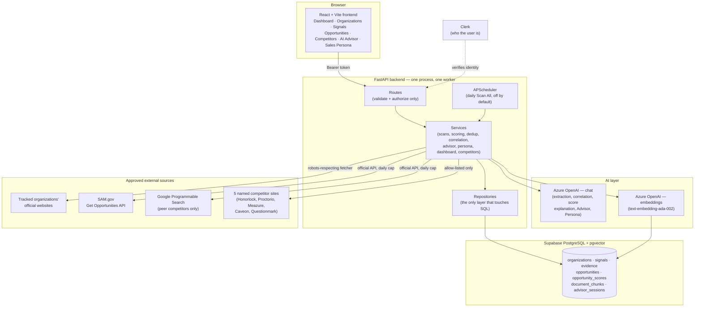
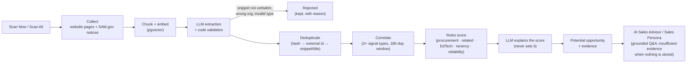
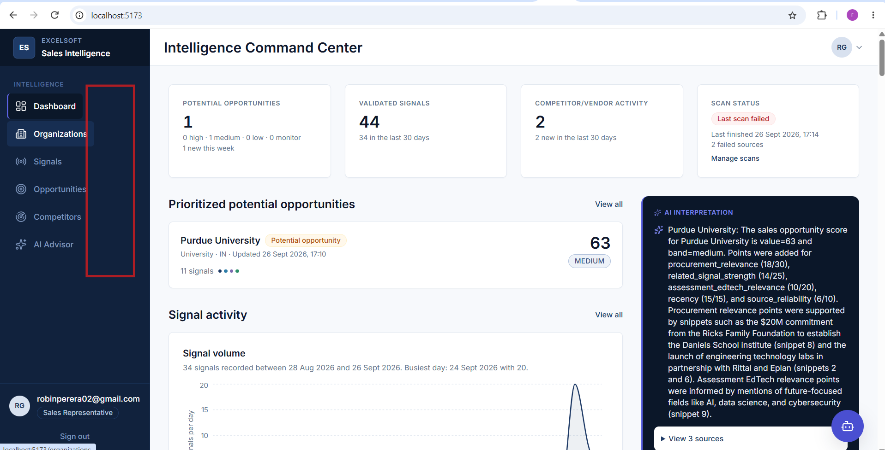

# AI Sales Intelligence — Solution Overview

A summary document for readers who need the problem, the solution, the architecture, and a look
at the product — without reading all nine documents in the [documentation map](../AGENTS.md#14-documentation-map).
It restates decisions already made in those documents; where the two disagree, the documents in
`docs/` win, per `AGENTS.md` §15.

---

## 1. The problem

Excelsoft's Americas sales team is four people, competing against vendors with larger sales
teams, bigger brand presence, and incumbent relationships in the US education market. The one
structural advantage a small team can build without adding headcount is intelligence — knowing
sooner, knowing more, and knowing what to do with it. That advantage does not exist today.

| # | Gap | Cost |
|---|---|---|
| 1 | **RFP-reactive selling.** Opportunities surface when the RFP is published — evaluation criteria already written, incumbent already entrenched, every competitor responding to the same document at once. | Low win rate, rushed responses, no pre-positioning with evaluators |
| 2 | **No early warning system.** Budget approvals, leadership changes, contract-expiry windows, and technology initiatives are all public, but nobody is watching them systematically. | Competitors who *are* watching get there first |
| 3 | **Competitor blind spots.** Honorlock, Proctorio, Meazure Learning, Caveon, and Questionmark publish updates, speak at events, and change their sites continuously. There is no systematic way to track it. | Positioning built on stale or missing information |
| 4 | **Geography and trend gaps.** No structured view of which states or verticals are moving fastest. | Territory and pipeline decisions made on gut feel |
| 5 | **Manual research overhead.** Each rep spends hours a week researching accounts and competitors, inconsistently, with no shared intelligence layer. | Time that should be spent selling |

The full problem statement is in `docs/DATA_SOURCES.md` and the original hackathon brief; this
table is the short version.

---

## 2. The solution

A continuously running intelligence engine that watches public sources on behalf of the sales
team, turns what it finds into scored, evidence-backed opportunities, and puts a copilot in front
of the rep for the research and outreach work that follows.

```
Public source → New information → Signal extraction → Duplicate detection → Signal validation
  → Related signal detection → Signal correlation → Potential opportunity
  → Hybrid opportunity score → Evidence → AI Sales Advisor → Recommended next research/action
```

A single weak signal is never treated as a guaranteed opportunity, and every claim the product
makes is separated into four layers: **observed fact** (cited), **AI interpretation**, **potential
opportunity**, and **recommended research/action**. Collapsing these — presenting interpretation
as fact — is treated as a product defect (`AGENTS.md` §1).

### What is built today

| Capability | Status | Notes |
|---|---|---|
| Website + SAM.gov collection, signal extraction, deduplication | **Built** | Runs per organization on Scan Now / Scan All |
| Correlation into a scored potential opportunity | **Built** | Rules compute the score; the model only explains it |
| AI Sales Advisor (grounded Q&A, scoped to one organization or opportunity) | **Built** | Answers "insufficient evidence" rather than guessing |
| Intelligence Command Center dashboard | **Built** | Metrics, top opportunities, signal volume, grounded AI insights |
| Competitor intelligence (Honorlock, Proctorio, Meazure, Caveon, Questionmark) | **Built** | Same scan pipeline; never produces a customer opportunity |
| Peer competitors (web search per organization) | **Built** | Needs a Google Programmable Search key to run |
| Sales Persona (daily copilot: briefings, call prep, competitor updates, draft emails) | **Built** | Scoped to one organization (Advisor-style) or general/portfolio data |
| Daily scheduler | **Built, off by default** | `SCHEDULER_ENABLED=true` |
| Trend intelligence (geography/vertical reports) | **Not built** | Roadmap |
| Pre-RFP action prompts stored per opportunity | **Not built** | Roadmap |

---

## 3. Architecture

### 3.1 System components



Clerk answers *who* the user is; FastAPI answers *what* they may do, using a role stored in
`app_users` keyed by the Clerk user id. Routes contain no SQL and no business rules; only
repositories touch the database (`backend/AGENTS.md`).

### 3.2 Signal-to-opportunity pipeline



### 3.3 Technology

| Layer | Choice |
|---|---|
| Frontend | React, Vite, Tailwind CSS, TanStack Query, Recharts, React Router |
| Backend | Python, FastAPI, one process / one worker |
| Database | Supabase PostgreSQL with pgvector |
| AI / RAG | Azure OpenAI (chat + embeddings), LangChain-style chunking, a provider-swappable adapter |
| Web collection | Requests-style fetcher with robots.txt, rate limiting, and same-domain redirects only |
| Scheduling | APScheduler (daily Scan All) |
| Auth | Clerk for identity; FastAPI for `SALES_REP` / `SALES_MANAGER` authorization |

Full detail: `docs/TECHNICAL_PRD.md`, `docs/DATABASE_DESIGN.md`, `docs/API_CONTRACT.md`,
`docs/AI_RAG_DESIGN.md`, `docs/DATA_SOURCES.md`.

---

## 4. The product

The Intelligence Command Center: opportunity, signal, and competitor metrics with scan status
across the top; prioritized opportunities, signal activity, and grounded AI insights below.



Other screens follow the same visual language (clean enterprise surfaces; darker indigo-accented
panels for AI and intelligence content) across Organizations, Signals, Opportunities,
Competitors, and the AI Advisor / Sales Persona. Full screen definitions: `docs/UI_UX_DESIGN.md`.

---

## 5. Where to go next

| Question | Document |
|---|---|
| What are the exact API shapes? | `docs/API_CONTRACT.md` |
| What are the tables and columns? | `docs/DATABASE_DESIGN.md` |
| How does grounding and hallucination control work? | `docs/AI_RAG_DESIGN.md` |
| What sources are approved, and why? | `docs/DATA_SOURCES.md` |
| What is left to build, in what order? | `docs/IMPLEMENTATION_PLAN.md` |
